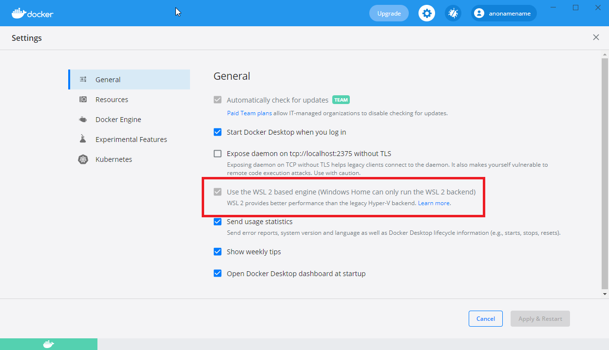
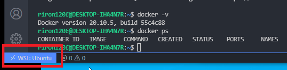

# WSL2+Docker+poetryでML環境(cpu only)構築

- 参考: 
  - https://cpp-learning.com/wsl2-docker-vscode/
  - https://wimper-1996.hatenablog.com/entry/2020/10/14/114458
  - https://qiita.com/yolo_kiyoshi/items/332ae902aeb730fbd068


## ディレクトリ構成

```
docker-ml
│──Dockerfile         # pyproject.toml で定義した各パッケージを自動でインストールするようにしたDockerfile
│──pyproject.toml     # poetryでパッケージ依存を管理。使ってるpoetry環境のpyproject.tomlに置き換えたらいい
│──prepare_poetry
　│──Dockerfile_poetry  # poetryをinstallするだけのDockerfile
│──※環境構築コマンド履歴.txt  # Dockerでpyproject.toml作る手順とかのメモ
│──docker-ml
　│──tests          # テストコード
　　│──main.py       # サンプル機械学習ソースコード(sklearn)
　　│──model         # モデル保存用フォルダ
　　└──run_model.sh  # main.py実行するシェルスクリプト
　│──my_package     # パッケージ化したいモジュール
　├──notebook       # EDAで使用するnotebook
　├──streamlit_app  # streamlitのapp
```


## pyproject.tomlにパッケージ追加する方法

- wsl2のコマンドプロンプト起動
```bash
$ cd ./docker_ml/prepare_poetry

# イメージ作成（pyproject.tomlを作るためだけのpoetryというDockerイメージ作成）
$ docker build -t poetry -f Dockerfile_poetry .

# コンテナ起動
$ docker run -it -v $PWD:/workdir --rm poetry /bin/bash

# カレントディレクトリのpyproject.tomlから必要なパッケージをインストール
$ poetry install  # 1からpyproject.toml を作る場合は$ poetry init

# pyproject.tomlに任意のパッケージ追加
$ poetry add <opencv-python-headless とか>

# コンテナから出る(--rm オプション付けて起動してるので、出たらコンテナ削除される)
$ exit
```


## pyproject.tomlからDockerイメージ作る手順

- wsl2のコマンドプロンプト起動

  **※作成したpyproject.toml を./docker_ml に置いておくこと！！！**
```bash
$ cd ./docker_ml

# イメージ作成（docker_mlというDockerイメージ作成. pyproject.tomlのパッケージをpipでinstallする）
$ docker build -t docker_ml -f Dockerfile .

# コンテナ起動
$ docker run -p 8889:8889 -p 8502:8502 -it -v $PWD/docker_ml:/docker_ml --rm docker_ml /bin/bash

# テストコード置いてるディレクトリに移動してモデル学習予測実行
$ cd tests/
$ ./run_model.sh
 
# http://localhost:8502/ からstreamlit起動確認
$ cd ..
$ streamlit run streamlit_app/app.py --server.port 8502

# http://localhost:8889/ からjupyter起動確認
$ jupyter lab --ip=0.0.0.0 --allow-root --no-browser --NotebookApp.token='' --port=8889
=> notebook/test.ipynb 実行（mlflowのファイル出力）

# http://localhost:8502/ からmlflow起動確認
$ cd notebook/
$ mlflow ui --port 8502 --host 0.0.0.0

# コンテナから出る(--rm オプション付けて起動してるので、出たらコンテナ削除される)
$ exit
```


※wsl2+Dockerはめちゃめちゃメモリを食うので微妙かも…

- https://zenn.dev/takajun/articles/4f15d115548899


-------------------------------------------------------------------------------------------------------------------


## VS Code から Docker に接続する手順（できなかった…）

- VS Codeの左下の「><」で「WSL: Ubuntu」選択（wsl2のもの選ぶ）
- VS Codeの上部のメニューからターミナル開く
- ディレクトリ移動 cd /mnt/c/Users/81908/MyGitHub/docker_ml/docker_ml
- VS Code左下の「><」をクリック
- Reopen in Container を選択
- From Dockerfile を選択
- 左下が「Dev Container: Existing Dockerfile」になったら接続成功


### 前提条件

- windows10
- WSL2インストール済み
- Visual Studio Codeインストール済み
  - VS Code 拡張機能の 「Remote - Containers 」をインストール済み
- Docker Desktopインストール済み
  - WSL2 を利用するチェック入ってる
  


### つまずいたところ

- **vscodeのターミナルは「>< WSL: Ubuntu」を指定しないと WSL2 に接続できない**（他に「>< WSL: Ubuntu-20.04」も選べるがこれはWSL2ではない。これ選択するとdocker コマンドエラーになる）
  

